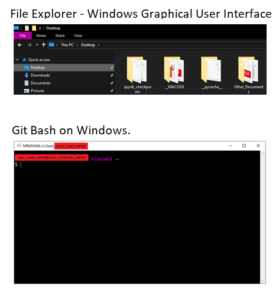

Here you will find instructions on how to install Bash in different operating systems. 

## What is Bash?

Bash is the **Bourne Again SHell**, one of the most popular **Unix Shell** there are. If you are not familiar with **Unix Shell**, the **Unix Shell** is a **command-line interface (CLI)** and a **scripting language**. It allows you to **automatize** processes and **access** the files and directories of your computer in an effective way. Much more effective than using the computer system’s graphical user interface (see Figure below).  

________________________

[Next      : Install Bash on Windows](02_Install_Bash_on_Windows.md)
[Next      : Install Bash on Linux](03_Install_Bash_on_Linux.md)
[Next      : Install Bash on MacOS](04_Install_Bash_on_MacOS.md)

[Go back  : Start Here](00_Start_Here.md)  
