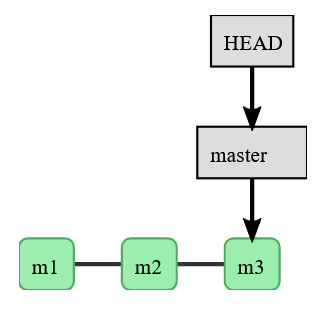
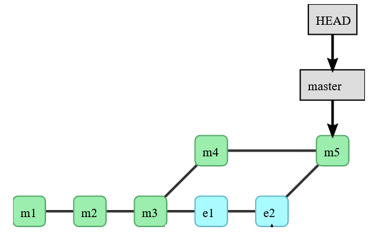

So far we have worked in a single *local* **master** branch: 

  

Image from [Code Refinery Branching and Merging lesson](https://coderefinery.github.io/git-intro/06-branches/)

And we have synced that *local* repo to a single *remote* **master** branch.

# Branching

**Branching** refers to creating a **separate "copy"** of a repository for private use. So that each branch is a **different line of development**. 

Branches are useful not only when you are working on a code by yourself, but also when coding in collaboration with others. And they are usually used for **bug fixing** and **testing**. When working individually on a code, you could for example have a branch called **testing** (for testing), or a branch to solve a specific issue with the code (called **issue_X**). When collaborating with others, each collaborator could be in charge of a specific task being worked on a specific branch.

To see all current branches in your repository (in `~/Desktop/Project_X`) you can do:

```
    git branch --all
```

This will show you the *local* branches of the *local* Git repository, and also the *remote* branches associated with it. The asterisk points to the branch you are currently in.

## How can I create more branches? 

You can create more *local* branches, as well as more *remote* branches.

Let's create a new *local* branch called **test_A** in the `~/Desktop/Project_X` Git *local* repository:

```
    ls  
    git log --oneline
    git branch test_A
    git branch --all
```

`git branch` created the new branch called **test_A**, but we have not moved to it (the asterisk is still next to **master**). We just have a copy of what was in the *local* **master** in the **test_A** branch. To move to **test_A** we can use `git switch`:

```
    git switch test_A
    git branch
    git log --oneline
    ls -a
```

`git branch` alone (without `--all`) shows only the local branches of the *local* Git repository. If you only want to see the *remote* branches associated to the *local* Git repository, you can do `git branch -r`.  

We can make a change in the `file_C.txt` of **test_A** branch:

```
    cat file_C.txt
    echo "Adding third line in test_A copy" >> file_C.txt
    cat file_C.txt
    git add file_C.txt
    git commit -m "Added line to file_C in test_A"
    git log --oneline
```

Let's switch back to the *local* **master**. Before we did this with `git switch` but we can also do it with:

```
    git checkout master
    ls
    cat file_C.txt
    git branch
```

To **switch from the current branch to another** we saw before you can use `git switch name_branch`, where `name_branch` is the name of the branch you want to move into. This instruction actually works for Git versions later than 2.23. You can also switch from the current branch to another one called `name_branch` by doing `git checkout name_branch`. Does `git checkout` sound familiar? Yes! We have already used it to restore a specific version of a file (specifying the hash of the commit and the respective file). The `checkout` command is a very versatile one! See more by looking at the manual with `git checkout --help` or `git help checkout`.

In Git versions later than 2.23, you can also create a new branch and switch to it in a single line of commands by typing: 

```
    git switch -c name_branch
```

Where the `-c` flag refers to create a new branch (called `name_branch`). It is important to mention you can also do this by using:

```
    git checkout -b name_branch
```

For example: let us create 2 more branches one called **test_B** and one called **test_C**:

```
    git checkout -b test_B
    git branch
    git switch -c test_C
    git branch
```

Let us say we decide to delete them, then we can use:

```
    git checkout master
    git branch -d test_B test_C
```

Above we first moved to the *local* **master** branch and then we deleted **test_B** and **test_C** *local* branches using the `-d` flag. We can also delete *remote* branches using `git branch -rd name_branch` (where `name_branch` is the *remote* branch to be deleted). This will delete the "link" to that remote branch from your *local* Git repository, but it will not delete the actual Gitlab repository. If you really want to delete a remote branch locally, then you have to do `git push origin --delete name_remote_branch` (with `name_remote_branch` the name of the remote branch you want to delete).

___________________________

### Important to keep in mind: switching branches changes files!

Keep in mind that **when you work in a given branch, Git will show you the version of files you last committed in that branch.** This means that when switching branches, files in your working directory will change. Do not panic! It is just because you are working in a different branch! 
___________________________

Let us say we are happy with the change we did to `file_C.txt` in **test_A** branch, and we would like to integrate the change we did in our *local* **master**. For this being in the **master** branch:

```
    git branch -a  
    cat file_C.txt
    git merge test_A
    cat file_C.txt
```

`git merge test_A` indicates we are merging the **test_A** branch with the current one (which in our case is the *local* **master**). 

To also have the latest updated version in the remote Gitlab repository, we can now push from the current branch to the *remote* (**origin**) **master**:

```
    git push origin master
```

We can go to the Gitlab repository and see that the `file_C.txt` (in the *remote* **master**) has been updated with the change we did in **test_A** (which is also in the *local* **master** of the `Project_X` *local* repository).


 

Image modified from [Code Refinery Branching and Merging lesson](https://coderefinery.github.io/git-intro/06-branches/)

________________________________________________________

### Parenthesis

When working with branches, you can check the "tree" structure specifying a few more tags when using `git log`:

```
    git log --all --graph --decorate --oneline
```

If you like this type of log, you can set up a `graph` alias in the `--global` configuration of Git:

```
    git config --global alias.graph "log --all --graph --decorate --oneline"
```

Another way to visualize tree structures of Git branches is to use an IDE, such as the Git Graph extension of VSCode. If you want to check how this extension works, check out this [video](https://youtu.be/u9ZQpKGTog4).

________________________________________________________

# Create a Remote Branch Locally

To create a new *remote* branch *locally* (from your work laptop/station), we can first create a *local* branch and then push it to the *remote*. First make sure you are in the `~/Desktop/Project_X`. Then: 

```
    git branch test_B
    git switch test_B 
    git push origin test_B 
    git branch -a
```

Here we created a new branch called **test_B**; we switched to it; and we pushed it to the **origin**. You can see now this **test_B** branch in the Giltab repository.

Changes made in the *local* **test_B** branch can be pushed directly to the *remote* **test_B** branch by doing (after adding and committing):

``` 
    git push origin test_B
```

If you want changes to be updated to the *local* **master**, you can **merge** the *local* **test_B** with the *local* **master** using `git merge test_B` in the *local* **master**. You can then update the *remote* **master** by doing:

```
    git push origin master
```

________________

## Important to consider

**Merging** refers to **applying the changes** from one file to another in order to **update** it. When working with different branches you will need to merge features from one branch into another.

Merging occurs when you do `git pull`. In fact `git pull` does a lot of things between the *local* and the *remote* branches, among which it calls the `merge` command which actually does the merging of files.

Specially when working collaboratively, it is recommended not to use `git pull` to update the *local* branch with the *remote* changes. It is recommended to do `git fetch` and then `git merge` instead. In this way, you can see what others have done and foresee what type of conflicts might arise when merging. 

________________________________________________________

### Parenthesis

We saw `git merge branch_name` allows you to merge the changes of the branch called `branch_name` with the branch you are currently working in. You can always undo this merging by doing `git merge --abort`. So do not worry! You can always undo things!

________________________________________________________

[Previous  : Exercise 2](08_Exercise_02.md)  

[Next      : Exercise 3](10_Exercise_03.md)


