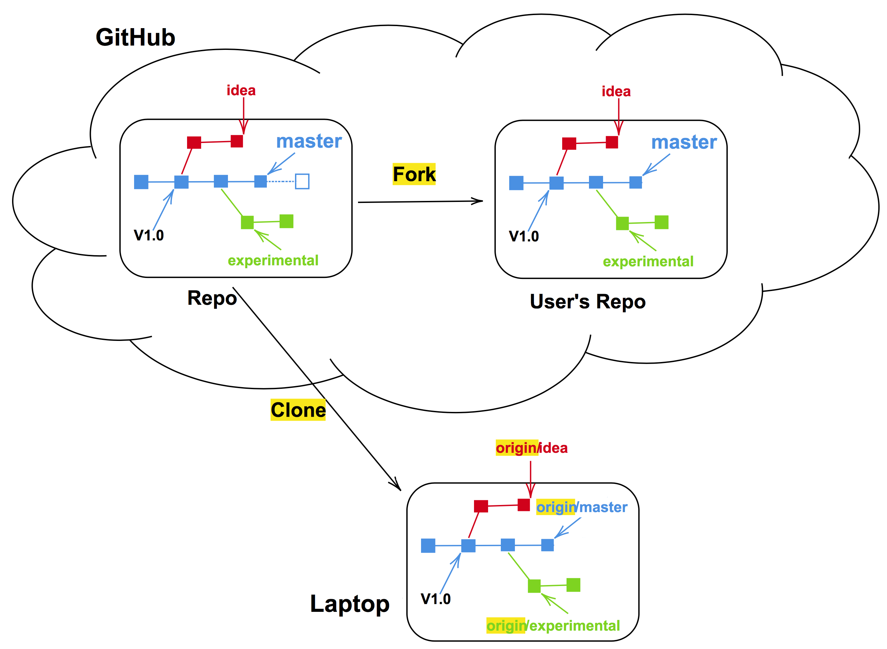

Forking refers to taking a copy of a *remote* repository, so that you can make changes and at some point ask to the owner(s) of the original repository if your changes can be merged with theirs.



Image from [Code Refinery Concepts Around Collaboration lesson](https://coderefinery.github.io/git-collaborative/01-remotes/). FYI: The image mentions Github, but it can be Gitlab too.

To fork another Gitlab repository:

- Go the Gitlab repository you want to fork, and use the **fork** button at the top right of the page. This will create a copy of the repository in your Gitlab.  

- Clone the forked copy to your *local* device.  

- Create a *local* branch where you will work on the changes you want to make.  

- Once all relevant changes have been added and committed, push from that *local* branch to the remote forked version.  

- In the Gitlab instance **request a merge** from the branch of your fork, to the **master** branch of the original repository. 

- The owner(s) of the original repository will then decide whether to merge the changes. If the owner(s) accepts the merge, you will receive a notification saying the merge has been accepted.

### Do you want to continue proposing other changes to the original *remote* repo? 

Before working on more changes, always pull the latest version of the *original* repository first:

```
    git checkout master
    git pull https_key_original master
    git push https_key_remote master
```

So pull the changes from the original (*remote*) repository (giving the respective `https_key_original`) **master** branch to your *local* **master**. And then push the changes from your *local* **master** to your *remote* fork (giving the respective `https_key_remote`).

______________________________

Congrats! You have reached the end of this material!

[Previous   : Exercise 3](10_Exercise_03.md)
